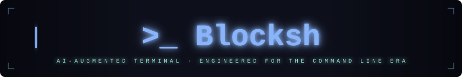

<div align="center">



<br><br>

[](https://python.org)
[](https://pypi.org/project/PySide6/)
[](https://pypi.org/project/pyte/)
[](https://sqlite.org)
[](https://kernel.org)
[](https://catppuccin.com)
[](https://en.wikipedia.org/wiki/Pseudoterminal)
[](https://github.com/rhaymisonbetini/Blocksh/releases)

<br>

<p>
  A <strong>Warp-inspired</strong>, block-based terminal emulator with full PTY support.<br>
  Built for developers who demand precision, context, and control over every command.
</p>

<br>

[](https://github.com/rhaymisonbetini/Blocksh/releases/latest/download/Blocksh-x86_64.AppImage)

</div>

---

## Install

### One-line install (recommended)

Installs Blocksh, creates the app icon and adds it to your system menu:

```bash
curl -fsSL https://raw.githubusercontent.com/rhaymisonbetini/Blocksh/main/install.sh | bash
```

After running, search **Blocksh** in your app launcher (GNOME Activities, KDE, etc.) — the icon will be there.

### Manual install

```bash
# 1. Download
wget https://github.com/rhaymisonbetini/Blocksh/releases/latest/download/Blocksh-x86_64.AppImage

# 2. Make executable
chmod +x Blocksh-x86_64.AppImage

# 3. Run
./Blocksh-x86_64.AppImage
```

> **No dependencies required.** Python, PySide6, Qt6 and everything else are bundled inside the AppImage.  
> All user data is stored in `~/.blocksh/` — created fresh and clean on first launch.

### Uninstall

```bash
rm ~/.local/bin/Blocksh.AppImage \
   ~/.local/share/icons/hicolor/256x256/apps/blocksh.png \
   ~/.local/share/applications/blocksh.desktop
```

---

## Table of Contents

- [Install](#install)
- [What is Blocksh?](#what-is-blocksh)
- [Screenshots](#screenshots)
- [Features](#features)
- [Architecture](#architecture)
- [Getting Started](#getting-started)
- [Keyboard Shortcuts](#keyboard-shortcuts)
- [Interactive PTY Mode](#interactive-pty-mode)
- [Settings](#settings)
- [Theming](#theming)
- [Project Structure](#project-structure)
- [Roadmap](#roadmap)

---

## What is Blocksh?

**Blocksh** reimagines the terminal by wrapping each executed command in its own isolated **block** — a visual card that captures stdout, stderr, exit codes, timestamps, and working directory context. Inspired by [Warp](https://warp.dev), it combines the familiarity of a traditional shell with a modern, structured UI built natively on Qt6.

Built entirely in Python with **PySide6**, Blocksh runs as a native desktop application on Linux with full **PTY (pseudo-terminal)** support for interactive programs: `vim`, `htop`, `ssh`, and AI agents like `claude`.

Starting from **v0.2.0**, Blocksh also ships a complete **Settings panel** with a live theme creator, font/cursor customization, shell and scrollback configuration, profile photo support, and full data management — all persisted in `~/.blocksh/settings.json`.

> *"Not just a terminal. A workspace for the command line."*

---

## Screenshots

<div align="center">

<table>
<tr>
<td align="center" width="50%">

**Clean Workspace**


*Collapsible sidebar, tab system, and the `run something great...` prompt*

</td>
<td align="center" width="50%">

**Command Blocks in Action**


*Icon-only sidebar, ANSI-colored output blocks with timestamps and directory context*

</td>
</tr>
</table>

</div>

---

## Features

### Block-Based Output
Every command runs in its own **block** — a self-contained card with:
- Command text and exit status indicator
- Full stdout/stderr with ANSI color rendering
- Timestamp and working directory
- Collapsible / expandable toggle
- Stop button (automatically appears after 10 seconds for long-running commands)

### Multi-Tab Workflow
- Open unlimited terminal sessions with `Ctrl+T`
- Each tab owns an independent `ShellSession` with isolated cwd and environment
- Close tabs with `Ctrl+W`; labeled tabs in the TabBar

### Full PTY Support
Interactive programs are automatically routed to a real **PTY canvas**:
- Covers `vim`, `nano`, `htop`, `ssh`, `claude`, Python REPL, Node.js, and more
- Direct `QPainter`-based cell rendering — no HTML, no Qt layout engine overhead
- Powered by `pyte` for accurate VT100/VT220 terminal emulation

### Persistent History
- All commands stored in `~/.blocksh/history.db` (SQLite)
- Browsable in the sidebar History panel
- Per-project command sub-history in the Projects panel
- Configurable retention policy (7 / 30 / 90 days or forever)

### Favorites & Projects
- **Favorites** — pin reusable commands with a name and cwd
- **Projects** — auto-detected from directory markers:
  - `.git` → Git
  - `package.json` → Node.js
  - `pyproject.toml` → Python
  - `Cargo.toml` → Rust
  - `go.mod` → Go
  - `composer.json` → PHP

### Collapsible Sidebar
The sidebar can be collapsed to a **48px icon-only strip** by clicking the `«` button at the top:
- Smooth 200ms ease animation
- All nav icons remain clickable with tooltips showing the action name
- Sub-pages (History, Favorites, Projects) auto-expand the sidebar before navigating
- Click `»` to restore full width

### Settings Panel
A full-width settings workspace (replaces the terminal area while open) with four sections:

| Section | What you can configure |
|---------|----------------------|
| **Appearance** | Font family (monospace filter), terminal/output font size, cursor style (block / underline / beam), output text color override, profile photo |
| **Terminal Behavior** | Default shell, scrollback lines, history load limit, auto-scroll, history retention |
| **Theme Creator** | 24-field color picker with live preview, save/delete user themes |
| **Data Management** | Clear history / favorites / projects / all data, export history to JSON |

Open settings via the `⚙` button in the TabBar or the **Settings** item in the sidebar nav.

### Profile Photo & Avatar
- Set a profile photo in **Settings → Appearance → Profile photo**
- The circular avatar in the top-right TabBar updates instantly — shows your photo or your initials with a themed fallback
- Clicking the avatar also opens Settings

### Intelligent `cd` Handling
`cd` commands are intercepted before execution. Path resolution happens in Python via `ShellSession.try_cd()`, updating the internal cwd. Subsequent commands inherit the correct directory without spawning a subprocess.

### Tab Completion
File and path completions via `CompletionPopup` — a floating overlay triggered by `Tab` in the input bar.

### Theming Engine
- **ThemeManager** singleton broadcasts `theme_changed(Palette)` signal
- Built-in: `dark` (Catppuccin Mocha) and `light` (Catppuccin Latte)
- User themes: create via the in-app **Theme Creator** or drop any compliant JSON into `~/.blocksh/themes/`

### Integrated Search
`Ctrl+F` toggles the `SearchBar` within the active terminal panel.

---

## Architecture

### Layer Overview

```
┌────────────────────────────────────────────────────────────────┐
│                          app/ui/                               │
│   MainWindow · Sidebar · TabBar · TerminalPanel(s)             │
│   SettingsPanel · PtyWidget · ANSI renderers · ThemeManager    │
├────────────────────────────────────────────────────────────────┤
│                       app/services/                            │
│   HistoryService · FavoritesService · ProjectService           │
│   SettingsService (singleton, emits settings_changed)          │
├────────────────────────────────────────────────────────────────┤
│                        app/core/                               │
│   ShellSession · BaseExecutor · CommandThread · PtyProcess     │
├────────────────────────────────────────────────────────────────┤
│                        app/infra/                              │
│   SQLite repositories · settings.py (paths) · DB_PATH         │
│   SettingsRepository (JSON r/w to ~/.blocksh/settings.json)    │
├────────────────────────────────────────────────────────────────┤
│                       app/domain/                              │
│   Command · Block · Favorite · Project · AppSettings           │
└────────────────────────────────────────────────────────────────┘
```

### UI Component Hierarchy

```
MainWindow
├── Sidebar                    (collapsible: 180px expanded / 48px icons-only)
│   ├── page 0: nav buttons    (Terminal · History · Favorites · Projects · ⚙ Settings · Themes)
│   ├── page 1: history list
│   ├── page 2: themes list
│   ├── page 3: favorites list
│   └── page 4: projects list  (collapsible, with command sub-history)
├── TabBar                     (+ tab · tab labels · ⌕ search · ⊟ collapse-all · ⚙ settings · avatar)
└── QStackedWidget (_right_stack)
    ├── page 0: terminal view
    │   └── TerminalPanel      (one per tab — owns ShellSession + HistoryService)
    │       ├── SearchBar      (hidden by default, Ctrl+F)
    │       ├── QScrollArea → blocks_container
    │       │   └── CommandBlock(s)  (card per executed command)
    │       ├── separator QFrame
    │       ├── InputBar       (QPlainTextEdit + Run button)
    │       └── CompletionPopup (floating overlay, Tab-triggered)
    └── page 1: settings view  (← Back header + SettingsPanel in QScrollArea)
        └── SettingsPanel
            ├── AppearanceSection  (font · cursor · output color · avatar)
            ├── TerminalSection    (shell · scrollback · history · auto-scroll)
            ├── ThemeCreatorSection (24-color picker · live preview · save/delete)
            └── DataManagementSection (clear · export)
```

### PTY Rendering Pipeline

```
PtyProcess (QThread)
    └─ data_ready(bytes) signal
         └─ PtyWidget._on_data()
              └─ pyte.ByteStream.feed()
                   └─ QTimer.singleShot(33 ms, _render)
                        └─ _PtyCanvas.update()
                             └─ _PtyCanvas.paintEvent(QPainter)
                                  cell-by-cell: col × char_w, row × char_h
```

> `_PtyCanvas` uses `WA_OpaquePaintEvent` and direct cell rendering. This replaced an earlier QTextEdit+HTML approach that caused UI trembling during high-frequency streaming.

### Non-Interactive Command Flow

```
InputBar.submit
    └─ TerminalPanel._on_command()
         ├─ [built-in: clear] → clear UI blocks, stop
         ├─ [built-in: cd]    → ShellSession.try_cd(), emit cwd_changed
         └─ CommandThread (QThread)
              └─ output_received(chunk) → CommandBlock.append_output()
                   → Stop button revealed after 10 s
```

### Settings Data Flow

```
SettingsPanel control change
    └─ SettingsService.update(**kwargs)
         ├─ dataclasses.replace(current, **kwargs)
         ├─ SettingsRepository.save()  →  ~/.blocksh/settings.json
         └─ settings_changed(AppSettings) signal
              ├─ PtyWidget._on_settings_changed()   (font · cursor · shell · scrollback)
              ├─ CommandBlock._build_output()        (output font · fg color override)
              └─ TabBar._refresh_avatar()            (circular avatar display)
```

### ANSI Rendering — Two Paths

| Context | Implementation | Mechanism |
|---------|---------------|-----------|
| `CommandBlock` (non-interactive) | `app/ui/ansi_renderer.py` | `render_ansi()` → `(text, QTextCharFormat)` segments inserted into `QTextEdit` cursor |
| PTY canvas | `app/ui/ansi_colors.py` + `pyte` screen buffer | Color attributes from pyte cell, resolved via `_resolve_color()` / `_256_to_hex()` |

### Data Storage

```
~/.blocksh/
├── history.db           ← SQLite: sessions · blocks · favorites · projects
├── settings.json        ← AppSettings (font, cursor, shell, avatar_path, …)
├── theme_pref.json      ← Active theme name (persisted across restarts)
└── themes/
    └── *.json           ← User-defined theme files (all Palette fields required)
```

---

## Getting Started

### Prerequisites

| Requirement | Minimum Version | Notes |
|-------------|----------------|-------|
| Python      | 3.10           | Required for `match` statements and `dataclasses` features |
| pip         | any            | For installing dependencies |
| Linux       | any modern     | PTY requires Unix `/dev/pts`; macOS untested |

### Installation

```bash
# 1. Clone the repository
git clone https://github.com/rhaymisonbetini/Blocksh.git
cd Blocksh

# 2. Create an isolated virtual environment
python -m venv .venv
source .venv/bin/activate

# 3. Install dependencies
pip install -r requirements.txt

# 4. Launch
python run.py
```

No build step. No compiled assets. No database migrations — `~/.blocksh/` and all required files are created automatically on first launch.

### Dependencies

| Package | Version | Role |
|---------|---------|------|
| `PySide6` | ≥ 6.6.0 | Qt6 bindings — entire UI layer, signals, QThread |
| `pyte`    | ≥ 0.8.0 | VT100/VT220 screen emulation for PTY mode |

---

## Keyboard Shortcuts

| Shortcut | Action |
|----------|--------|
| `Ctrl+T` | Open new terminal tab |
| `Ctrl+W` | Close current tab |
| `Ctrl+F` | Toggle search bar |
| `Ctrl+L` | Clear all command blocks |
| `Escape` | Close Settings panel (if open) |
| `Tab`    | Trigger path / file completion |
| `↑` / `↓` | Navigate command history in the input bar |
| `Enter`  | Execute command |

---

## Interactive PTY Mode

Blocksh automatically detects when a command requires a real pseudo-terminal and launches `PtyWidget` instead of a `CommandBlock`.

**Always PTY-routed** (`_ALWAYS_INTERACTIVE` in `terminal_panel.py`):

```
nano   vim    nvim   vi     emacs   helix
htop   top    btop   less   more    man
ssh    sftp   ftp    mysql  psql    redis-cli  sqlite3
claude  ...
```

**PTY on bare call** (no arguments — REPL detection via `_INTERACTIVE_NO_ARGS`):

```
python  python3  ipython
node    irb      php
bash    sh       zsh    fish
```

**Shell alias detection:** a short `bash -i` subprocess resolves shell aliases that map to PTY commands before routing.

The `PtyWidget` overlays the entire `TerminalPanel` via `setGeometry(self.rect()) + raise_()` — not inserted into the Qt layout. `resizeEvent` on `TerminalPanel` keeps the overlay geometry in sync.

---

## Settings

The Settings panel is opened via the `⚙` button or avatar in the TabBar, or the **Settings** entry in the sidebar. It replaces the terminal area while open; press `← Back`, click **Terminal** in the sidebar, or press `Escape` to return.

All settings are persisted immediately to `~/.blocksh/settings.json` on every change and broadcast via `SettingsService.settings_changed` so widgets update live without restart.

### AppSettings Reference

| Field | Type | Default | Description |
|-------|------|---------|-------------|
| `font_family` | `str` | `"Monospace"` | Terminal font family (monospace fonts only) |
| `font_size_terminal` | `int` | `10` | PTY canvas font size (pt) |
| `font_size_output` | `int` | `9` | CommandBlock output font size (pt) |
| `cursor_style` | `str` | `"block"` | `"block"` · `"underline"` · `"beam"` |
| `output_fg_override` | `str` | `""` | Hex color for CommandBlock text; empty = use theme `fg` |
| `default_shell` | `str` | `"bash"` | Shell used for PTY sessions (sourced from `/etc/shells`) |
| `scrollback_lines` | `int` | `2000` | `pyte.HistoryScreen` history depth |
| `history_limit` | `int` | `200` | Max blocks loaded in the History sidebar panel |
| `auto_scroll` | `bool` | `True` | Scroll to latest output on new command |
| `history_retention_days` | `int` | `0` | Days to keep history (0 = forever) |
| `avatar_path` | `str` | `""` | Absolute path to profile photo (PNG/JPG/WebP) |

> Shell and scrollback changes take effect on new terminal tabs; existing tabs are not affected.

### Theme Creator

The **Theme Creator** section in Settings lets you build a fully custom theme without editing JSON by hand:

1. All 24 color fields are displayed as clickable swatches with a live preview frame
2. Click any swatch to open the system color picker
3. Enter a name and click **Save theme** — the theme is saved to `~/.blocksh/themes/<name>.json` and immediately available in the Themes sidebar
4. Existing user themes are listed below with a **Delete** button

---

## Theming

Blocksh uses a **`Palette` dataclass** as the single source of truth for all colors. The `ThemeManager` singleton emits `theme_changed(Palette)` and every widget subscribes via `apply_theme(p: Palette)`.

### Built-in Themes

| Theme | Base Palette |
|-------|-------------|
| `dark`  | [Catppuccin Mocha](https://catppuccin.com) |
| `light` | [Catppuccin Latte](https://catppuccin.com) |

### Color Reference — Dark Theme

| Token | Hex | Role |
|-------|-----|------|
| `bg` | `#0d0f1a` | Main window background |
| `bg_panel` | `#12141f` | Sidebar and tab bar background |
| `bg_surface` | `#161926` | Cards, command blocks |
| `bg_overlay` | `#1e2235` | Hover / active overlays |
| `fg` | `#cdd6f4` | Primary text |
| `fg_muted` | `#6c7086` | Secondary text, timestamps |
| `fg_dim` | `#45475a` | Dimmed / disabled text |
| `blue` | `#89b4fa` | Accents, active states, links |
| `green` | `#a6e3a1` | Success indicators (exit 0) |
| `red` | `#f38ba8` | Error text |
| `red_ui` | `#e64553` | Danger buttons, destructive actions |
| `cyan` | `#94e2d5` | PTY cursor, highlights |
| `border` | `#313244` | Panel / card borders |
| `pty_bg` | `#0d0f1a` | PTY canvas background |
| `pty_fg` | `#cdd6f4` | PTY canvas default foreground |
| `pty_cursor_bg` | `#cdd6f4` | PTY cursor fill |
| `pty_cursor_fg` | `#0d0f1a` | PTY cursor text |

### Custom Themes

The easiest way is the in-app **Theme Creator** (Settings → Theme Creator). Alternatively, drop a `.json` file into `~/.blocksh/themes/` containing every `Palette` field:

```json
{
  "name": "my-theme",
  "bg": "#1a1a2e",
  "bg_panel": "#16213e",
  "bg_surface": "#0f3460",
  "bg_overlay": "#1a1a40",
  "bg_hover": "#162040",
  "bg_hover2": "#1e2850",
  "bg_active": "#0f3460",
  "bg_selected": "#1a3a70",
  "bg_highlight": "#1a2850",
  "fg": "#e0e0e0",
  "fg_muted": "#888888",
  "fg_dim": "#555555",
  "blue": "#4fc3f7",
  "green": "#81c784",
  "red": "#e57373",
  "red_ui": "#e53935",
  "cyan": "#4dd0e1",
  "border": "#2a2a5a",
  "pty_bg": "#1a1a2e",
  "pty_fg": "#e0e0e0",
  "pty_cursor_bg": "#e0e0e0",
  "pty_cursor_fg": "#1a1a2e"
}
```

Activate via **Themes** in the sidebar — no restart required.

---

## Project Structure

```
.
├── run.py                        ← Entry point: python run.py
├── requirements.txt              ← PySide6, pyte
└── app/
    ├── main.py                   ← Bootstrap: DI wiring, QApplication launch
    ├── domain/                   ← Pure data models (zero external dependencies)
    │   ├── command.py            ← Command(text, status, timestamp)
    │   ├── block.py              ← Block(command + stdout/stderr/exit_code/cwd)
    │   ├── favorite.py           ← Favorite(name, command_text, cwd)
    │   ├── project.py            ← Project(name, path, type, uuid) · ProjectContext
    │   └── settings.py           ← AppSettings(font, cursor, shell, scrollback, avatar_path, …)
    ├── core/                     ← Execution engine (no Qt UI, no services imports)
    │   ├── shell_session.py      ← cwd/env state, cd intercept, alias detection
    │   ├── command_executor.py   ← BaseExecutor, SubprocessExecutor, CommandThread
    │   └── pty_process.py        ← QThread: PTY runner, data_ready(bytes) signal
    ├── services/                 ← Business logic layer
    │   ├── history_service.py    ← Session history, dedup, in-memory cache
    │   ├── favorites_service.py  ← CRUD wrapper over FavoritesRepository
    │   ├── project_service.py    ← auto_register() on cwd_changed, type detection
    │   └── settings_service.py   ← Singleton; update(**kwargs) → save + signal
    ├── infra/                    ← Persistence and configuration
    │   ├── config/
    │   │   └── settings.py       ← APP_DIR · DB_PATH · THEMES_DIR · SETTINGS_PATH
    │   └── storage/
    │       ├── database.py       ← SQLite connection + schema init
    │       ├── history_repository.py
    │       ├── favorites_repository.py
    │       ├── project_repository.py
    │       └── settings_repository.py  ← JSON r/w, merges missing keys with defaults
    └── ui/                       ← All PySide6 widgets
        ├── main_window.py        ← Root window, DI entry point, _right_stack routing
        ├── sidebar.py            ← Collapsible sidebar (« / »), QStackedWidget pages
        ├── tab_bar.py            ← Tab management, ⚙ settings, circular avatar
        ├── terminal_panel.py     ← Core terminal: PTY routing, command dispatch
        ├── command_block.py      ← Per-command output card widget
        ├── pty_widget.py         ← PTY overlay + _PtyCanvas (QPainter cell rendering)
        ├── input_bar.py          ← QPlainTextEdit + Run button
        ├── search_bar.py         ← Ctrl+F search overlay
        ├── completion_popup.py   ← Floating Tab-completion overlay
        ├── settings_panel.py     ← Settings UI: Appearance · Terminal · ThemeCreator · Data
        ├── theme.py              ← Palette dataclass · ThemeManager · DARK · LIGHT
        ├── ansi_renderer.py      ← Non-interactive ANSI → QTextCharFormat segments
        └── ansi_colors.py        ← PTY color resolution: _resolve_color() / _256_to_hex()
```

---

## Roadmap

| Sprint | Focus | Status |
|--------|-------|--------|
| Sprint 1 | PTY Core — arrow keys, Ctrl mapping, alternate screen buffer, bracketed paste | ✅ Done |
| Sprint 2 | Streaming Output — `\r` progress bars, truecolor, OSC sequences, SGR attributes | ✅ Done |
| Sprint 3 | Input & Shell — readline shortcuts, dynamic height, history dedup, PATH completion | ✅ Done |
| Sprint 4 | Performance — PTY off main thread, dirty tracking, resize throttling, block height cap | ✅ Done |
| Sprint 5 | Polish — box-drawing fonts, initial terminal size, Ctrl+C kill, scrollback ratio | ✅ Done |
| v0.2.0   | Settings panel, Theme Creator, AppSettings, collapsible sidebar, profile avatar | ✅ Done |

---

<div align="center">

<br>

[](https://python.org)
[](https://qt.io)
[](https://catppuccin.com)

<br>

<sub>Built with precision. Designed for the terminal.<br>
<em>Blocksh — because every great command deserves its own stage.</em></sub>

<br><br>

</div>
